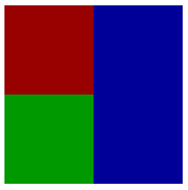

Имеeтся следующий index.html:


```html
<!doctype html>
<html lang="en">
  <head>
    <meta charset="UTF-8"/>
    <title>RGB blocks</title>
    <link href="index.css" rel="stylesheet"/>
    <script src="index.js"></script>
  </head>
  <body>
    <div class="wrapper">
      <div class="red"></div>
      <div class="green"></div>
      <div class="blue"></div>
    </div>
    <div class="dashboard">
      <p>Красный блок кликнули <span class="red-counter">0</span> раз.</p>
      <p>Зелены блок кликнули <span class="green-counter">0</span> раз.</p>
      <p>Синий блок кликнули <span class="blue-counter">0</span> раз.</p>
    </div>
  </body>
</html>
```

index.css:

```css
.red {
  background: #900;
}

.green {
  background: #090;
}

.blue {
  background: #009;
}
```

и index.js:

```js
function main () {
  var panelsElements = document.querySelector('.wrapper');
  [].slice.apply(panelsElements.children).forEach(function (panelElement) {
    var panel = new Panel();
    panel.init(panelElement);
  });
}

window.onload = main;
```

Сверстать лэйаут:



Реализовать компонент Panel, который считает клики по блоку, и выводит их количество в `.counters` 
